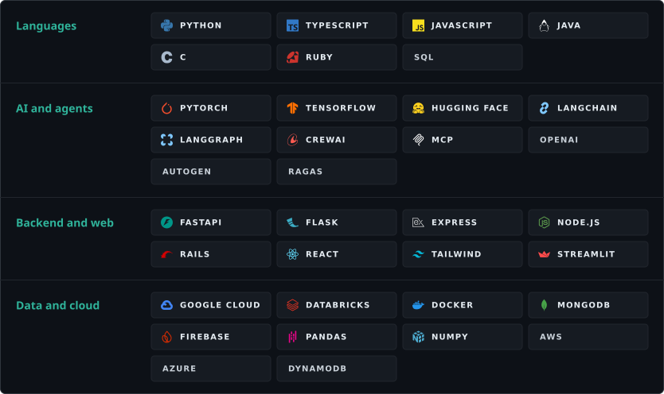

### 💫 About me

- 🧭 Current focus is **agentic AI**. The hard parts are orchestration, reliability and knowing when the agent should stop.
- 🎓 SUTD Computer Science and Design (2026), Honours with Distinction. Data Analytics and FinTech tracks, AI minor.
- 💼 Previously Application Dev & Ops intern at **Singtel** and Software Engineering intern at **pQCee**.

### 🧰 Tech stack

### 🚀 Featured work

<table>
  <tr>
    <td width="33%" valign="top">
      <b><a href="https://github.com/yuhueng/NLP-Project">Singlish LLM</a></b> 
      Qwen3-4B · QLoRA · Hugging Face · FastAPI · React  
      Fine-tuned a Singlish base model with 4-bit QLoRA, trained four persona adapters and wrapped it in a moderated chat app.  
      <a href="https://github.com/yuhueng/NLP-Project">Repo</a> · <a href="https://yh-singlish-chatbot.vercel.app">Live demo</a>
    </td>
    <td width="33%" valign="top">
      <b><a href="https://github.com/yuhueng/LeftOverChef">LeftoverChef</a></b> 
      Java · Firebase · YOLOv5 · OpenAI  
      Android app that turns a photo of leftovers into recipes. Honourable mention, Singtel merit award.  
      <a href="https://github.com/yuhueng/LeftOverChef">Repo</a> · <a href="https://youtu.be/bmkhyujBJh4">Demo video</a>
    </td>
    <td width="33%" valign="top">
      <b><a href="https://github.com/yuhueng/YH-Web">Portfolio website</a></b> 
      React · Express · Node.js · MongoDB · Tailwind  
      MERN portfolio with form validation and automated email handling, deployed on Vercel and DigitalOcean.  
      <a href="https://github.com/yuhueng/YH-Web">Repo</a> · <a href="https://ngyuhueng.com">ngyuhueng.com</a>
    </td>
  </tr>
</table>

### 🏅 Certifications

<table>
  <tr>
    <td valign="middle"></td>
    <td valign="middle">
      <b><a href="https://www.coursera.org/professional-certificates/ibm-rag-and-agentic-ai">IBM RAG and Agentic AI Professional Certificate</a></b> 
      IBM · LangChain, LangGraph, CrewAI, AutoGen, BeeAI, MCP, FAISS, ChromaDB
    </td>
    <td valign="middle" align="right">2026</td>
  </tr>
</table>

### 📊 GitHub

  
  

